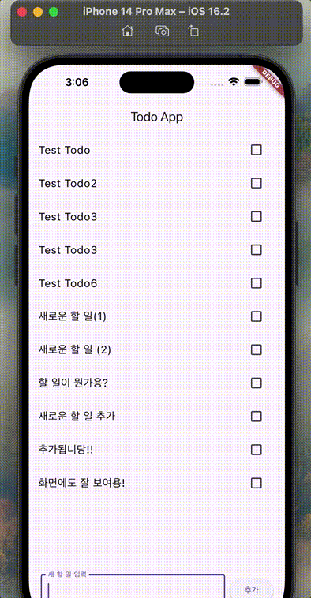

# Flutter Todo App 간단 단계별 구현 가이드

---

## Step 1: 기본 투두리스트 목록 만들기

* `TodoItem` 모델 정의 (id, text, done)
* API로 서버에서 할 일 목록 불러오기
* `ListView`로 할 일 리스트 보여주기

```dart
// TodoItem 모델 예시
class TodoItem {
  final int id;
  final String text;
  bool done;

  TodoItem({required this.id, required this.text, this.done = false});
}
```

```dart
// ListView에 todos 띄우기 (간단히)
ListView(
  children: todos.map((todo) => Text(todo.text)).toList(),
);
```


---

## Step 2: 체크박스 눌러 완료 여부 수정하기

* `TodoItemWidget`에 `Checkbox` 추가
* 체크 상태 바뀌면 API 호출해서 서버에 업데이트
* 상태 변경되면 UI 다시 렌더링

```dart
Checkbox(
  value: todo.done,
  onChanged: (bool? value) {
    if (value == null) return;
    // 부모에 변경 사항 알려주기
    onChanged(TodoItem(id: todo.id, text: todo.text, done: value));
  },
),
```

---

## Step 3: 투두 아이템 삭제 기능 추가하기

* `TodoItemWidget`에 삭제 버튼 추가
* 삭제 버튼 누르면 해당 아이템 서버에서 삭제
* 상태에서 해당 아이템 제거 후 UI 업데이트

```dart
IconButton(
  icon: Icon(Icons.delete, color: Colors.red),
  onPressed: () {
    onDelete(todo);
  },
),
```


## Step 4: ✏️ 할 일 수정 기능 추가하기

* `TodoItemWidget`에서 제목 부분을 탭하면 `AlertDialog`로 수정 UI 띄우기
* 사용자가 새로운 제목을 입력하면 서버에 PATCH 요청
* 성공 시 로컬 `todos` 리스트도 갱신

```dart
onTap: () async {
  final newTitle = await showDialog<String>(
    context: context,
    builder: (_) => AlertDialog(
      title: Text('할 일 수정'),
      content: TextField(
        controller: TextEditingController(text: todo.text),
        decoration: InputDecoration(hintText: '새 제목 입력'),
        autofocus: true,
      ),
      actions: [
        TextButton(child: Text('취소'), onPressed: () => Navigator.pop(context)),
        ElevatedButton(child: Text('저장'), onPressed: () {
          Navigator.pop(context, editController.text);
        }),
      ],
    ),
  );

  if (newTitle != null && newTitle.trim().isNotEmpty) {
    await ApiService.updateTodoTitle(todo.id, newTitle);
    onEditTitle(todo.copyWith(text: newTitle));
  }
},
```

---

## Step 5: ✅ 삭제/수정/추가/체크 시 토스트(스낵바) 알림 띄우기

* 재사용 가능한 `showAppToast()` 함수 만들기 (`utils/show_toast.dart`)
* 각 액션 완료 후 `showAppToast(context, '할 일이 삭제되었습니다!')` 형태로 사용
* 디자인 통일과 사용자 피드백 강화

```dart
// utils/show_toast.dart
void showAppToast(BuildContext context, String message,
    {Color backgroundColor = Colors.black87,
     IconData icon = Icons.check_circle}) {
  ScaffoldMessenger.of(context).showSnackBar(
    SnackBar(
      content: Row(
        children: [
          Icon(icon, color: Colors.white),
          SizedBox(width: 8),
          Expanded(child: Text(message, style: TextStyle(color: Colors.white))),
        ],
      ),
      backgroundColor: backgroundColor,
      behavior: SnackBarBehavior.floating,
      margin: EdgeInsets.symmetric(horizontal: 16, vertical: 10),
      shape: RoundedRectangleBorder(borderRadius: BorderRadius.circular(12)),
      duration: Duration(seconds: 2),
    ),
  );
}
```

```dart
// 사용 예
showAppToast(context, '삭제되었습니다!', backgroundColor: Colors.red, icon: Icons.delete);
showAppToast(context, '수정 완료!');
showAppToast(context, '할 일이 추가되었습니다!');
```

---

## Step 6: 🧭 하단 네비게이션바로 메인 화면 구성

* `BottomNavigationBar`를 활용해서 여러 페이지로 구성
* 예: Todo 목록 / 완료된 목록 / 설정 등
* 각각의 페이지는 `IndexedStack`이나 `PageView`로 관리

```dart
int _selectedIndex = 0;
final List<Widget> _pages = [TodoPage(), DonePage(), SettingsPage()];

@override
Widget build(BuildContext context) {
  return Scaffold(
    body: _pages[_selectedIndex],
    bottomNavigationBar: BottomNavigationBar(
      currentIndex: _selectedIndex,
      onTap: (index) => setState(() => _selectedIndex = index),
      items: [
        BottomNavigationBarItem(icon: Icon(Icons.list), label: '할 일'),
        BottomNavigationBarItem(icon: Icon(Icons.check), label: '완료'),
        BottomNavigationBarItem(icon: Icon(Icons.settings), label: '설정'),
      ],
    ),
  );
}
```

